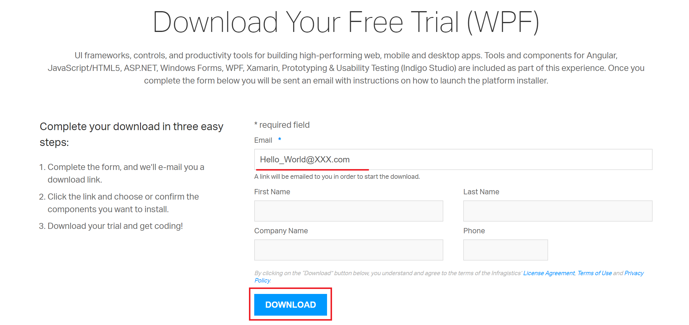
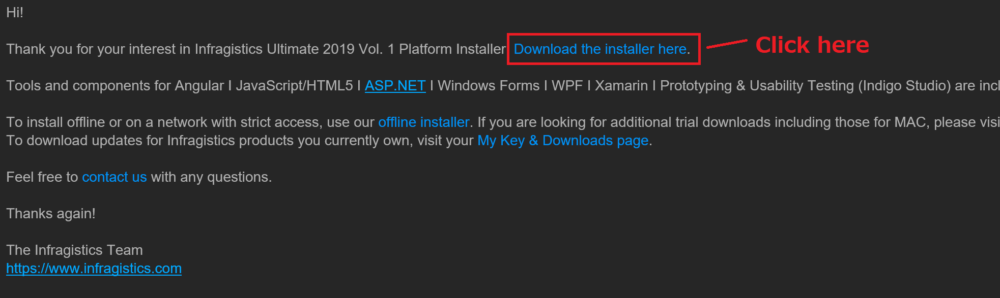
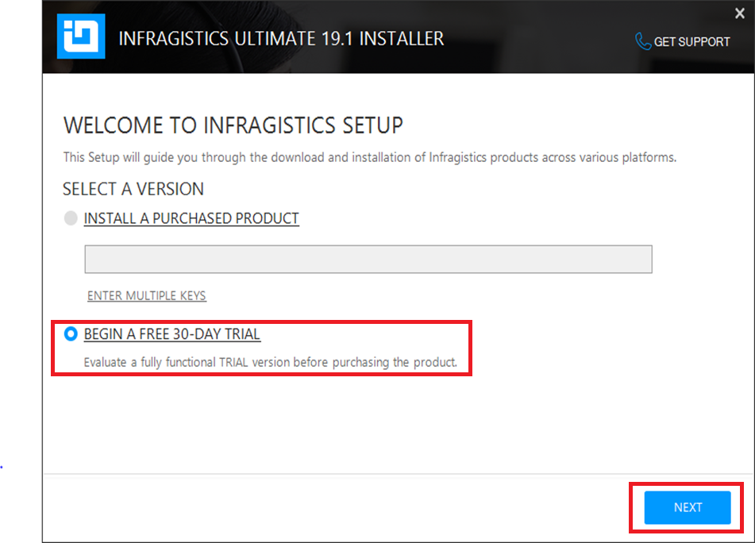
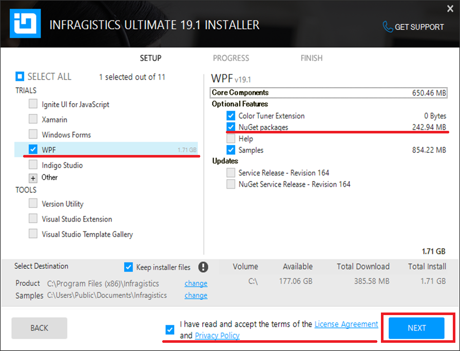
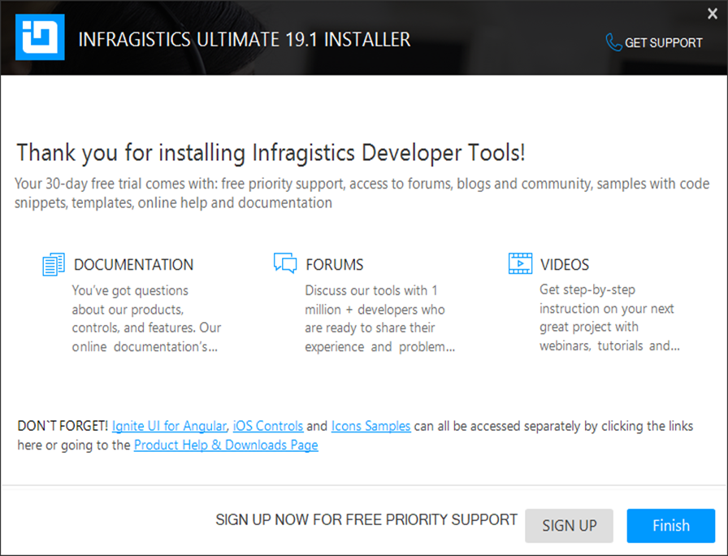

# How to get Infragistics WPF Nuget packages
Follow the steps below to get Infragistics WPF Nuget packages that can be used in .NET Core 3.0 project.

## Download the installer

[Click here](https://www.infragistics.com/products/ultimate/download?p=wpf) to go to download center. Fill out your email address and click DOWNLOAD button.

You would receive an email like below image. Click the link to download the installer.

## Run the installer

Unzip the file you downloaded and run the EXE file. Select "BIGIN A FREE 30-DAY TRIAL" and go NEXT.

Check WPF on left side menu and check Nuget packages on right side menu. Check the bottom item and go Next to start the installation.

Congratulations! Now you have Infragistics WPF Nuget packages installed on your PC.

The Nuget packages should be in your Public user's document folder   `C:\Users\Public\Documents\Infragistics\NuGet`   or your Program Files   `C:\Program Files (x86)\Infragistics\2019.1\WPF\NuGet Packages`.